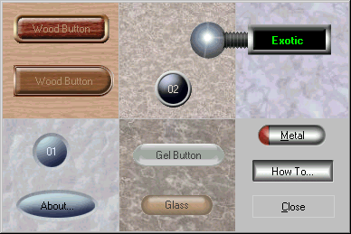



## EasyButton 2\.0

### Description

This is the second version of my EasyButton.

Now support transparent background and can play

sounds on click too. You can make easily buttons

in any format.
 
### More Info
 

             |
---                |---
**Submitted On**   |2002-06-04 19:51:50
**By**             |[Arruda](https://github.com/Planet-Source-Code/PSCIndex/blob/master/ByAuthor/arruda.md)
**Level**          |Intermediate
**User Rating**    |4.8 (145 globes from 30 users)
**Compatibility**  |VB 4\.0 \(32\-bit\), VB 5\.0, VB 6\.0
**Category**       |[Custom Controls/ Forms/  Menus](https://github.com/Planet-Source-Code/PSCIndex/blob/master/ByCategory/custom-controls-forms-menus__1-4.md)
**World**          |[Visual Basic](https://github.com/Planet-Source-Code/PSCIndex/blob/master/ByWorld/visual-basic.md)
**Archive File**   |[EasyButton90317642002\.zip](https://github.com/Planet-Source-Code/arruda-easybutton-2-0__1-35413/archive/master.zip)

